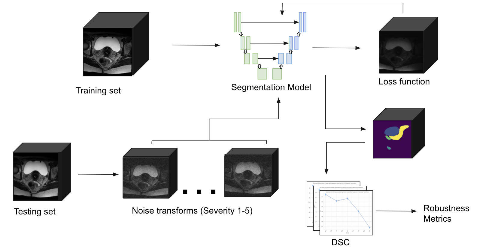

# nnUnet_segmentation_model_benchmark
The data that was used for this project is stored at '/cluster/projects/radiomics/Gyn_Autosegmentation/Task80_gyn' in H4H radiomics folder.

## How Testing Robusness of a Segmentation Model Works
### 1.Generate a Benchmarking Dataset
>- Change the input and output path in /segmentation_robustness/examples/dataset_generation.py and run this file.
>- The transformations for benchmarking dataset generation are stored in /segmentation_robustness/examples/roodmri/transforms/defaults.py, which can be modified if needed.

### 2.Testing the Model on the Benchmarking Dataset
>- Instructions for running nnUnet model inference can be found at https://github.com/MIC-DKFZ/nnUNet#run-inference.
>- Other models such as UNet/UNetR can be tested with the testing file segmentation_robustness/test.py.

### 3.Calculating Evaluation Metrics
>- Evaluation metrics for each severity level + transformation combination can be calculated using /segmentation_robustness/generate_metrics.py, there are different functions in this file for multilabel/siglelabel segmentation.
>- A csv file will be generated from generate_metrics.py.

### 4.Calculating Degradation Metrics
>- Be sure to add evaluation metrics for the clean image to the csv file generated form step 3.
>- Degradation Metrics can be calculated using /segmentation_robustness/examples/metric_calculations.py, column names should be change accordingly.
>- Please see https://arxiv.org/abs/2203.06060 for formula and interpretations of the degradation metrics.
